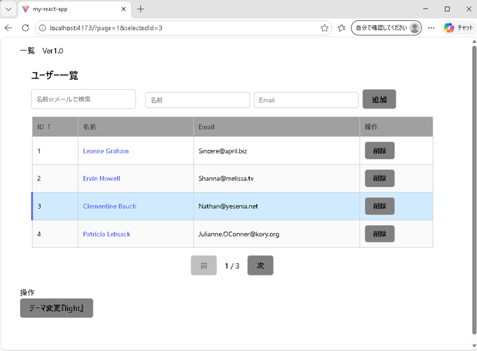
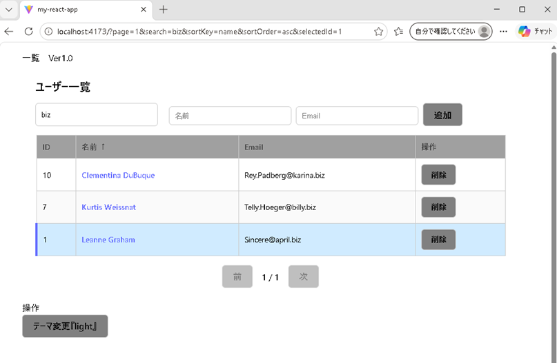
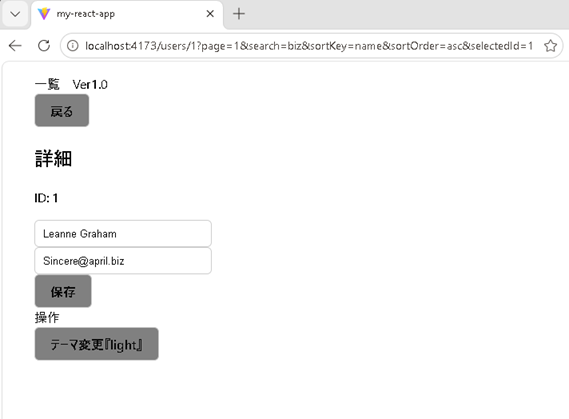
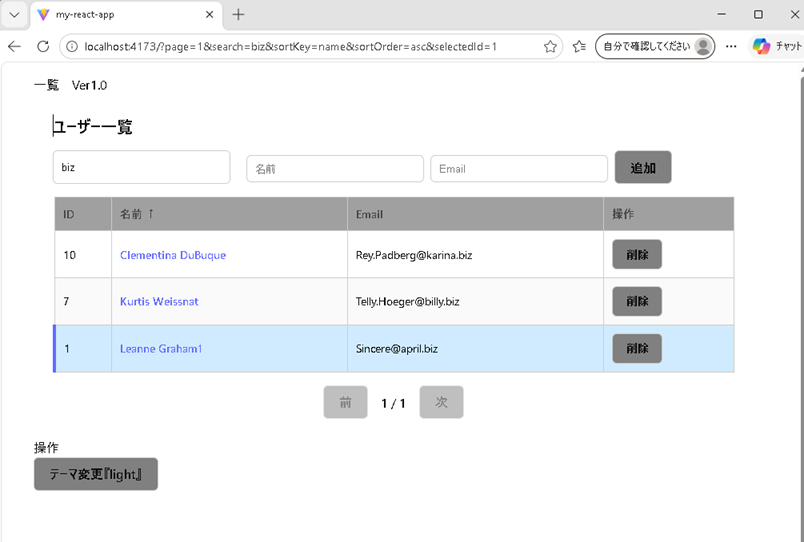

# React User Management App
ユーザー管理を行うシンプルなReactアプリです。  
検索・ソート・ページング・キーボード操作に対応しています。
※ 本アプリはデモ用のため、外部API（JSONPlaceholder）を利用しています。
一部の更新・削除操作は実際には反映されません。

---

## 🔗 デモ

https://react-user-management-6zxe73x89-nakamura-hideakis-projects.vercel.app

---

## 📸 画面イメージ

### 一覧画面


### 検索（名前で絞り込み）


### 詳細画面


### 編集後（更新反映）



---

## 🚀 主な機能

一覧表示（ページネーション）
検索（名前・メール）
ソート（ID / 名前）
追加 / 削除 / 編集
キーボード操作（↑ ↓ Enter）
URLクエリで状態管理
技術スタック
TypeScript
React
React Router
CSS（ダークモード対応）
工夫した点
URLと状態の同期（検索・ソート・選択）
カスタムフック分離（useUsers / useKeyboardNavigation）
UI/UX（選択行・ダークモード）
画面
キーボード操作の実装
  - ↑ ↓：選択移動
  - Enter：詳細画面へ
  - Esc：戻る

---

## 🎯 このアプリでできること
- ユーザー一覧表示
- 検索・絞り込み
- ソート
- ページング
- キーボード操作対応

---

## 🧠 工夫したポイント

- URLクエリパラメータで状態管理
- カスタムフックによるロジック分離
  - useKeyboardNavigation
  - useQueryParams
- 検索・ソート・ページングの統合制御
- UIとロジックの責務分離
- テーマ切替（CSS変数）

---

## 🛠 使用技術

- React
- TypeScript
- React Router
- Vite

---
## 起動方法
```
npm install
npm run preview
```

## 📂 ディレクトリ構成
```
src/
 ├─ api/
 │   └─ UsersApi.ts
 │
 ├─ assets/
 │   └─ react.svg
 │
 ├─ components/
 │   ├─ Pagination.tsx
 │   ├─ SearchBox.tsx
 │   ├─ UserForm.tsx
 │   └─ UserTable.tsx
 │
 ├─ hooks/
 │   ├─ useKeyboardNavigation.ts
 │   ├─ useQueryParams.ts
 │   └─ useUsers.ts
 │
 ├─ pages/
 │   └─ UserList.tsx
 │
 ├─ styles/
 │   ├─ button.css
 │   ├─ form.css
 │   ├─ layout.css
 │   └─ table.css
 │
 ├─ types/
 │   └─ User.ts
 │
 ├─ App.tsx
 ├─ AppContext.tsx
 ├─ Footer.tsx
 ├─ Header.tsx
 ├─ index.css
 ├─ main.tsx
 ├─ ThemeContext.tsx
 └─ UserDetail.tsx
```


